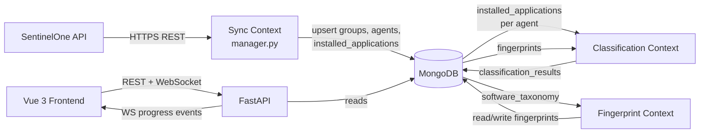
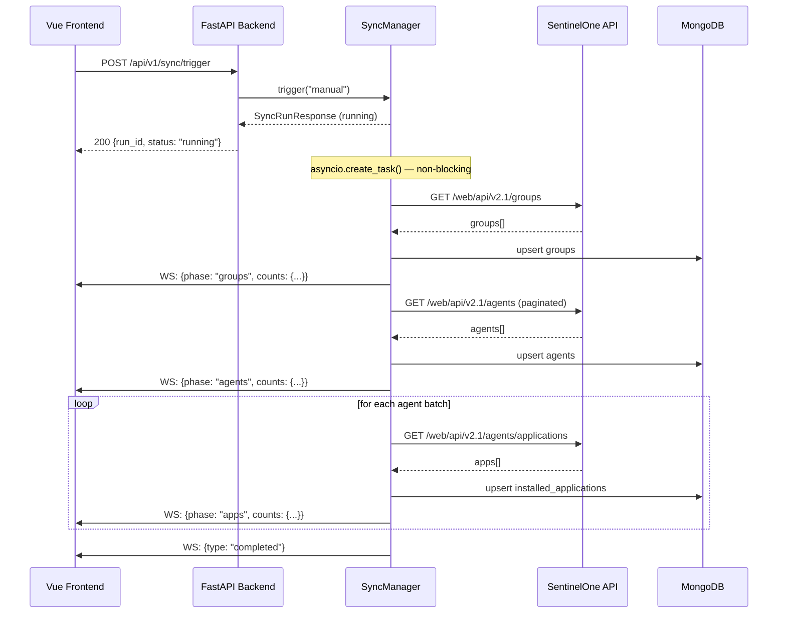
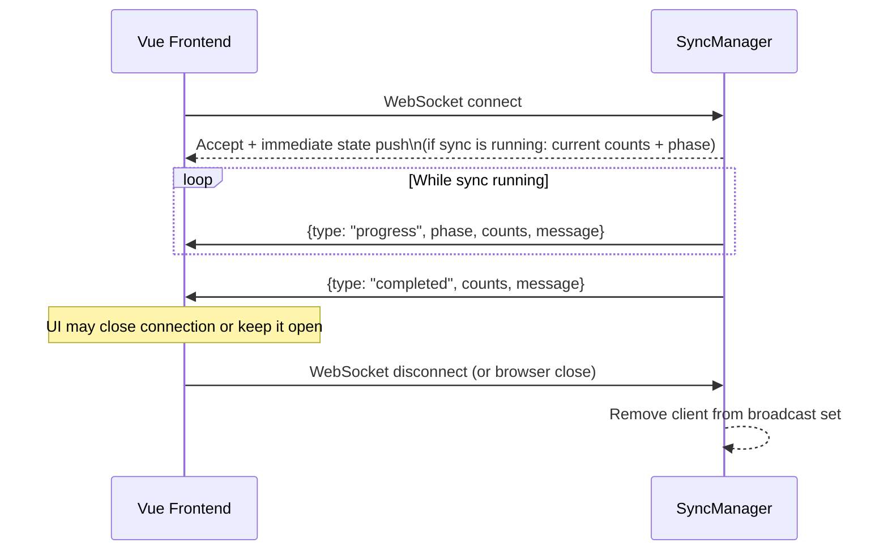

# Data Flow

This document describes how data moves through Sentora: from the SentinelOne API through ingestion, into the classification engine, and out to the frontend.

---

## High-Level Data Lifecycle



The bounded contexts interact exclusively through MongoDB — there is no direct in-process function call across context boundaries (other than shared infrastructure like `database.py` and `config.py`).

---

## Sync Flow

### Overview

A sync is triggered manually via `POST /api/v1/sync/trigger`. The endpoint returns immediately with a `run_id` and status `running`. The actual data-fetching pipeline runs as a non-blocking `asyncio` background task inside `SyncManager._run_sync()`. Progress is broadcast to all connected WebSocket clients at `ws://host:5002/api/v1/sync/progress`.

### Sequence Diagram



### Sync Phases

The sync pipeline progresses through five independent phases. Each phase runs on its own schedule and can be triggered individually.

| Phase | S1 API endpoint | MongoDB collection | WS phase field |
|---|---|---|---|
| Sites | `GET /web/api/v2.1/sites` | `s1_sites` | `"sites"` |
| Groups | `GET /web/api/v2.1/groups` | `s1_groups` | `"groups"` |
| Agents | `GET /web/api/v2.1/agents` (paginated) | `s1_agents` | `"agents"` |
| Applications | `GET /web/api/v2.1/agents/applications` (per agent batch) | `s1_installed_apps` | `"apps"` |
| Tags | `GET /web/api/v2.1/tags` | `s1_tags` | `"tags"` |

All five collections are upserted (insert or update on S1 ID), so re-running a sync is safe and idempotent.

### Rate Limiting

The S1 API client respects the `S1_RATE_LIMIT_PER_MINUTE` setting. Requests are queued with a token-bucket strategy. If the API returns a 429 the client waits for the retry-after period before continuing. A `S1RateLimitError` is raised if the backoff period exceeds the configured limit, which causes the sync run to fail with status `failed`.

### Concurrency Guard

`SyncManager` uses an `asyncio.Lock` to enforce that only one sync runs at a time. A second call to `POST /api/v1/sync/trigger` while a sync is running returns `409 Conflict` with `{"detail": "A sync is already running"}`.

### Sync Run Persistence

Sync run records are persisted to the `s1_sync_runs` MongoDB collection. The `SyncManager` singleton loads history from the database on startup via `init()`, so sync history survives process restarts. The in-memory state is kept in sync with the database. History is exposed via `GET /api/v1/sync/history`.

---

## Classification Flow

### What Triggers Classification

Classification is triggered by `POST /api/v1/classification/run`. It can be triggered manually from the UI or called by any HTTP client. There is no automatic re-classification on sync completion in the current implementation; operators trigger it explicitly after a sync.

### What the Engine Computes

For each agent in the `agents` collection:

1. Fetch all `installed_applications` records for the agent.
2. For each fingerprint in the `fingerprints` collection:
   a. For each marker in the fingerprint, test whether any of the agent's `installed_applications.normalized_name` values match any of the marker's glob patterns.
   b. Sum the weights of matching markers.
   c. If any marker has `required=true` and did not match, the fingerprint score for this agent is forced to zero.
   d. Normalize the score to the range 0.0–1.0 by dividing by the total possible weight.
3. Select the highest-scoring fingerprint. Determine the verdict:
   - `correct` — highest score belongs to the agent's own group fingerprint and score ≥ `CLASSIFICATION_THRESHOLD`.
   - `misclassified` — a different group's fingerprint scored higher than the agent's own group.
   - `ambiguous` — the gap between the top two scores is ≤ `AMBIGUITY_GAP`.
   - `unclassifiable` — no fingerprint scored ≥ `CLASSIFICATION_THRESHOLD`, or the agent's group has no fingerprint.
4. Write a `ClassificationResult` document (upsert on `agent_id`), recording the verdict, all scores, and `computed_at`.

### Universal Application Threshold

Applications present in more than `UNIVERSAL_APP_THRESHOLD` fraction of all agents (e.g. system runtimes, common browsers) are excluded from scoring by default. Each SoftwareEntry can also be individually marked `is_universal=true` via the taxonomy UI. Universal exclusions prevent ubiquitous software from artificially inflating scores for all groups.

### Result Storage

Results are stored in the `classification_results` collection, one document per agent. The `acknowledged` field lets operators mark a result as reviewed. `GET /api/v1/classification/results` exposes paginated, filterable access to results. `GET /api/v1/classification/results/{agent_id}` returns the result for a specific agent.

---

## Fingerprint Change Flow

When an operator creates, edits, or deletes a fingerprint via the Fingerprint API:

1. The change is written to the `fingerprints` collection immediately.
2. Any existing `ClassificationResult` documents for agents in the affected group become stale — they reflect the old fingerprint definition. The UI indicates this with a "stale" warning badge.
3. The operator triggers a new classification run (`POST /api/v1/classification/run`) to re-score all agents against the updated fingerprints. Results are then current.

There is no automatic re-classification on fingerprint change. This is intentional: it prevents unexpected result changes when operators are mid-edit on a fingerprint, and it keeps the classification run as an explicit, auditable operation.

---

## WebSocket Connection Lifecycle

The sync progress WebSocket is available at `ws://host:5002/api/v1/sync/progress`.



**Key behaviors:**

- On connect, `SyncManager.connect()` immediately sends the current run state to the new client so it does not miss progress from an already-running sync.
- Clients are tracked in a `set[WebSocket]`. Dead connections (where `send_text` raises) are removed from the set lazily during the next broadcast.
- The WebSocket endpoint reads messages from the client but ignores them. Clients may send pings to keep the connection alive; the server does not respond to them explicitly.
- If the server process restarts while a client is connected, the WebSocket is severed. The frontend reconnects on the next sync trigger.
- Multiple browser tabs / clients can connect simultaneously; all receive the same broadcast.

**WebSocket message shape:**

```json
{
  "type": "progress",
  "run_id": "3f2a1c...",
  "status": "running",
  "phase": "agents",
  "counts": {
    "groups_synced": 14,
    "groups_total": 14,
    "agents_synced": 240,
    "agents_total": 348,
    "apps_synced": 0,
    "apps_total": 0,
    "errors": 0
  },
  "message": "Syncing agents (240 / 348)…"
}
```

The `type` field is one of `progress`, `completed`, or `failed`. The frontend uses this to update the progress bar and transition to the final state UI.

---

## Authentication Flow

Sentora supports two authentication methods. The `get_auth_context` dependency in `domains/api_keys/middleware.py` unifies both into a single `AuthContext` dataclass.

### JWT Authentication (Users)

Standard flow for the web UI:

1. User submits credentials to `POST /api/v1/auth/login`.
2. Backend validates password, checks account lockout, verifies TOTP if enabled.
3. Backend creates a server-side session, issues JWT access token (15 min) + refresh token (7 days).
4. Frontend stores tokens in `localStorage` and attaches `Authorization: Bearer <jwt>` to every request.
5. On 401, the Axios interceptor transparently refreshes the token.

### API Key Authentication (External Integrations)

Flow for SIEM, dashboards, and automation:

1. Admin creates an API key via `POST /api/v1/api-keys/` (JWT required).
2. The full key (`sentora_sk_live_...`) is returned once; only the SHA-256 hash is stored.
3. External system sends requests with `Authorization: Bearer sentora_sk_live_...` or `X-API-Key: sentora_sk_live_...`.
4. Middleware detects the `sentora_sk_` prefix, hashes the key, looks up the hash in `api_keys` collection.
5. Validates: active status, expiration, grace period (for rotated keys), per-key rate limits.
6. Returns an `AuthContext` with `auth_type="api_key"`, tenant, and expanded scopes.
7. Scope enforcement checks that the key has the required scope for each endpoint.
