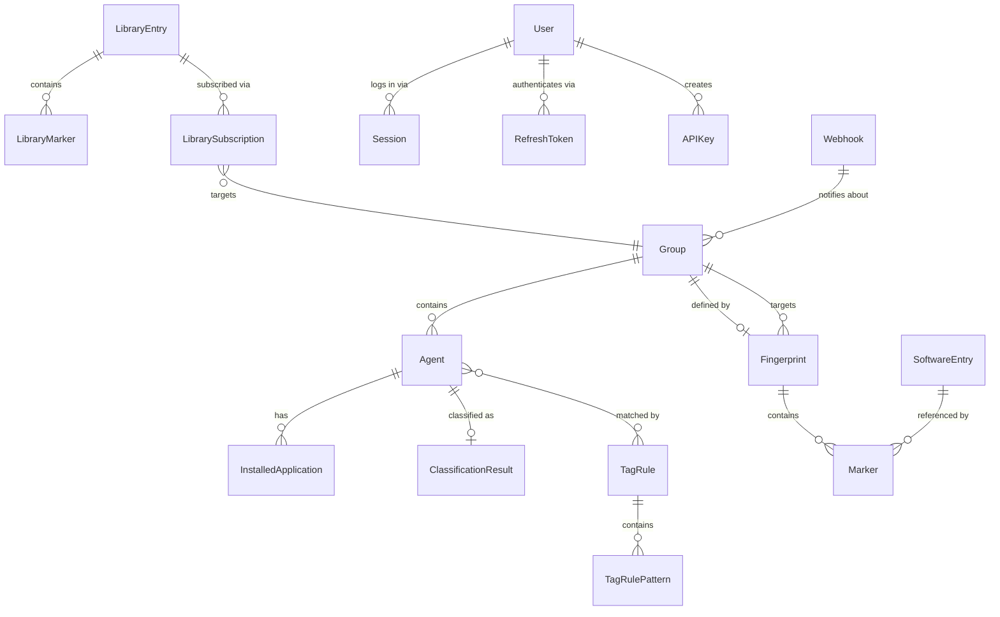

# Domain Model

This document describes the entities stored in MongoDB, how they relate to each other, and the cross-context reference policy that keeps bounded contexts decoupled.

---

## Entity Overview

| Entity | Context | Collection | Key Purpose |
|---|---|---|---|
| Site | Sync | `sites` | A SentinelOne site, synced from the S1 API |
| Group | Sync | `groups` | A SentinelOne agent group, synced from the S1 API |
| Agent | Sync | `agents` | A SentinelOne managed endpoint |
| InstalledApplication | Sync | `installed_apps` | A single application record from an agent's inventory |
| SourceTag | Sync | `source_tags` | A SentinelOne tag definition |
| SoftwareEntry | Taxonomy | `taxonomy_entries` | A known application in the software catalog, with glob patterns |
| TaxonomyCategory | Taxonomy | `taxonomy_categories` | A software category in the taxonomy hierarchy |
| Fingerprint | Fingerprint | `fingerprints` | A weighted set of markers that defines what a group's software should look like |
| Marker | Fingerprint | embedded in `fingerprints` | A single pattern rule within a fingerprint |
| ClassificationResult | Classification | `classification_results` | The scored verdict for one agent against all fingerprints |
| TagRule | Tags | `tag_rules` | A named tag + set of glob patterns; agents whose installed apps match any pattern receive the tag in S1 |
| TagRulePattern | Tags | embedded in `tag_rules` | A single glob pattern within a tag rule |
| LibraryEntry | Library | `library_entries` | A reusable fingerprint template with versioned markers, sourced manually or from public databases |
| LibraryMarker | Library | embedded in `library_entries` | A single glob-pattern marker within a library entry |
| LibrarySubscription | Library | `library_subscriptions` | Links a library entry to an S1 group; markers are auto-synced into the group's fingerprint |
| IngestionRun | Library | `library_ingestion_runs` | Tracks a source ingestion execution (NIST CPE, MITRE, Chocolatey, Homebrew) |
| User | Auth | `users` | A registered user account with role, password hash, TOTP secret, and account lifecycle status |
| Session | Auth | `sessions` | Server-side session tracking for immediate invalidation and device management |
| RefreshToken | Auth | `refresh_tokens` | Refresh token metadata for JWT token rotation with family-based revocation |
| APIKey | API Keys | `api_keys` | A tenant-scoped API key for external integrations with scopes and rate limits |
| Webhook | Webhooks | `webhooks` | A webhook endpoint registration for event-driven notifications |
| ComplianceResult | Compliance | `compliance_results` | A snapshot of a single control check within a compliance run |
| EnforcementRule | Enforcement | `enforcement_rules` | A software policy rule anchored to a taxonomy category |
| EnforcementResult | Enforcement | `enforcement_results` | A snapshot of a single enforcement rule check |

---

## Entity Relationship Diagram

**Reading the diagram:**

- Each Group contains zero or more Agents (a Group with no agents is valid but uninteresting).
- Each Agent has zero or more InstalledApplications. These are synced from SentinelOne and represent the raw application inventory.
- Each Group may have at most one Fingerprint (a Fingerprint targets exactly one Group).
- A Fingerprint contains one or more Markers. Each Marker optionally references a SoftwareEntry from the taxonomy.
- Each Agent has at most one ClassificationResult (updated each time classification runs).

---

## Entities

### Group

Represents a SentinelOne agent group. Synced from `GET /web/api/v2.1/groups`.

| Field | Type | Description |
|---|---|---|
| `_id` | `string` | UUID document ID |
| `source` | `string` | Data source identifier (e.g. `sentinelone`) |
| `source_id` | `string` | Source-native group ID (unique) |
| `name` | `string` | Human-readable group name |
| `site_id` | `string` | Site ID this group belongs to |
| `site_name` | `string` | Site display name (denormalized for query convenience) |
| `agent_count` | `int` | Number of agents in the group as reported by the source |
| `synced_at` | `datetime` | UTC timestamp of the last successful sync for this group |

**Index:** `source_id` (unique). Used for upsert during sync.

---

### Agent

Represents a SentinelOne managed endpoint. Synced from `GET /web/api/v2.1/agents`.

| Field | Type | Description |
|---|---|---|
| `_id` | `string` | UUID document ID |
| `source` | `string` | Data source identifier (e.g. `sentinelone`) |
| `source_id` | `string` | Source-native agent ID (unique) |
| `hostname` | `string` | Endpoint hostname |
| `os_type` | `string` | Operating system family (`windows`, `macos`, `linux`) |
| `os_version` | `string` | Full OS version string |
| `agent_status` | `string` | Agent connection status (`connected`, `disconnected`, etc.) |
| `group_id` | `string` | Foreign key → `groups.source_id` |
| `group_name` | `string` | Denormalized group name |
| `last_active` | `datetime` | Last time the agent checked in |
| `synced_at` | `datetime` | UTC timestamp of the last successful sync |

**Index:** `source_id` (unique), `group_id`.

---

### InstalledApplication

A single application entry from an agent's application inventory. Synced from `GET /web/api/v2.1/agents/applications`.

| Field | Type | Description |
|---|---|---|
| `_id` | `string` | UUID document ID |
| `agent_id` | `string` | Foreign key → `agents.source_id` |
| `name` | `string` | Raw application name as reported by S1 |
| `normalized_name` | `string` | Lowercased, whitespace-normalized version of `name`. Used for glob pattern matching |
| `publisher` | `string \| null` | Publisher / vendor name |
| `version` | `string \| null` | Application version string |
| `install_date` | `string \| null` | Installation date as reported by the OS |

**Index:** `agent_id`. Compound index on `(agent_id, normalized_name)` for fingerprint matching queries.

**Note on normalization:** `normalized_name` is computed at ingest time by lowercasing and collapsing whitespace in the raw `name` field. Fingerprint glob patterns are matched against `normalized_name`, not `name`.

---

### SoftwareEntry (Taxonomy)

A known application in the software catalog. Entries are either seeded from the bundled YAML at first startup (`user_added=False`) or created by users at runtime (`user_added=True`).

| Field | Type | Description |
|---|---|---|
| `_id` | `string` | MongoDB document ID |
| `name` | `string` | Human-readable display name (e.g. `Siemens WinCC`) |
| `patterns` | `string[]` | Glob patterns matched against `normalized_name`. Patterns are OR-combined. |
| `publisher` | `string \| null` | Expected publisher / vendor name |
| `category` | `string` | Primary category key (e.g. `scada_hmi`) |
| `category_display` | `string` | Human-readable category label (e.g. `SCADA / HMI / Process Control`) |
| `subcategory` | `string \| null` | Optional finer-grained sub-grouping |
| `industry` | `string[]` | Industry tags (e.g. `["manufacturing", "water_treatment"]`) |
| `description` | `string \| null` | Optional free-text description |
| `is_universal` | `bool` | When `true`, excluded from fingerprint suggestions by default (e.g. browsers, runtimes) |
| `user_added` | `bool` | `false` for seed data; `true` for entries created via UI or API |
| `created_at` | `datetime` | UTC timestamp of first insertion |
| `updated_at` | `datetime` | UTC timestamp of most recent update |

**Indexes:** `category` (for category-filtered list queries), `name` (for search), compound text index on `(name, patterns)`.

---

### Fingerprint

A weighted set of markers that describes what software should be present on agents belonging to a specific SentinelOne group. One fingerprint per group maximum.

| Field | Type | Description |
|---|---|---|
| `_id` | `string` | MongoDB document ID |
| `group_id` | `string` | Foreign key → `groups.source_id`. Must be unique across the collection. |
| `group_name` | `string` | Denormalized group name for display purposes |
| `markers` | `Marker[]` | Ordered list of markers that define the fingerprint |
| `created_at` | `datetime` | UTC timestamp when the fingerprint was created |
| `updated_at` | `datetime` | UTC timestamp of the most recent change |

**Index:** `group_id` (unique).

---

### Marker

A single pattern rule embedded within a Fingerprint document. Not stored as a separate collection.

| Field | Type | Description |
|---|---|---|
| `id` | `string` | UUID, unique within the parent fingerprint |
| `software_entry_id` | `string \| null` | Optional reference → `software_taxonomy._id`. `null` for free-form markers not linked to the catalog. |
| `display_name` | `string` | Human-readable label shown in the UI |
| `patterns` | `string[]` | Glob patterns matched against agent `installed_applications.normalized_name` |
| `weight` | `float` | Contribution to the overall fingerprint score (default `1.0`) |
| `required` | `bool` | If `true`, absence of this marker causes the agent to score zero regardless of other matches |

---

### ClassificationResult

The scored verdict for one agent, produced by the Classification engine. Updated on each classification run.

| Field | Type | Description |
|---|---|---|
| `_id` | `string` | MongoDB document ID |
| `agent_id` | `string` | Foreign key → `agents.source_id` |
| `hostname` | `string` | Denormalized hostname for query/display |
| `group_id` | `string` | Foreign key → `groups.source_id` |
| `group_name` | `string` | Denormalized group name |
| `classification` | `string` | Verdict: `correct` / `misclassified` / `ambiguous` / `unclassifiable` |
| `best_match_group_id` | `string \| null` | The group whose fingerprint produced the highest score |
| `best_match_group_name` | `string \| null` | Denormalized name of the best-matching group |
| `best_score` | `float` | Score (0.0–1.0) for the best-matching fingerprint |
| `scores` | `object` | Map of `group_id → score` for all evaluated fingerprints |
| `computed_at` | `datetime` | UTC timestamp when this result was computed |
| `acknowledged` | `bool` | Whether an operator has reviewed and acknowledged this result |

**Index:** `agent_id` (unique), `group_id`, `classification`.

**Verdict semantics:**

| Verdict | Condition |
|---|---|
| `correct` | The agent's own group fingerprint scored above `CLASSIFICATION_THRESHOLD` and is the best match |
| `misclassified` | A different group's fingerprint scored higher than the agent's own group fingerprint |
| `ambiguous` | The top two scores are within `AMBIGUITY_GAP` of each other, making a definitive verdict unreliable |
| `unclassifiable` | No fingerprint scored above `CLASSIFICATION_THRESHOLD`, or the agent's group has no fingerprint |

---

### TagRule

A named tag rule that matches agents via glob patterns and applies a tag back to S1.

| Field | Type | Description |
|---|---|---|
| `_id` | `string` | MongoDB document ID |
| `tag_name` | `string` | The S1 tag key to apply (unique). Written to S1 via `manage-tags`. |
| `description` | `string` | Optional free-text description |
| `patterns` | `TagRulePattern[]` | Ordered list of glob patterns |
| `apply_status` | `string` | `idle` / `running` / `done` / `failed` |
| `last_applied_at` | `datetime \| null` | Timestamp of the last successful apply |
| `last_applied_count` | `int` | Number of agents tagged in the last apply run |
| `created_at` | `datetime` | UTC timestamp of creation |
| `updated_at` | `datetime` | UTC timestamp of the most recent update |

**Index:** `tag_name` (unique), `apply_status`.

---

### TagRulePattern

A single glob pattern embedded within a TagRule document.

| Field | Type | Description |
|---|---|---|
| `_id` | `string` | Pattern ID (ObjectId string, unique within the parent rule) |
| `pattern` | `string` | Glob matched against agent `installed_app_names` (supports `*` and `?`) |
| `display_name` | `string` | Human-readable label shown in the UI |
| `category` | `string` | Category key (e.g. `name_pattern`) |
| `source` | `string` | `manual` (user-added) or `seed` |
| `added_at` | `datetime` | UTC timestamp when the pattern was added |

---

### LibraryEntry

A reusable fingerprint template in the shared library. Entries can be created manually or ingested from public sources (NIST CPE Dictionary, MITRE ATT&CK, Chocolatey, Homebrew).

| Field | Type | Description |
|---|---|---|
| `_id` | `string` | MongoDB document ID |
| `name` | `string` | Human-readable name (e.g. "Google Chrome") |
| `vendor` | `string` | Software vendor/publisher |
| `category` | `string` | Taxonomy category key |
| `description` | `string` | Free-text description |
| `tags` | `string[]` | Free-form tags for filtering |
| `markers` | `LibraryMarker[]` | Glob-pattern markers |
| `source` | `string` | Origin: `manual`, `nist_cpe`, `mitre`, `chocolatey`, `winget`, `homebrew`, `community` |
| `upstream_id` | `string \| null` | External identifier (CPE URI, MITRE ID) |
| `version` | `int` | Internal version, bumped on each update |
| `status` | `string` | `draft`, `pending_review`, `published`, `deprecated` |
| `subscriber_count` | `int` | Denormalized count of subscribing groups |
| `created_at` | `datetime` | Creation timestamp |
| `updated_at` | `datetime` | Last update timestamp |

**Index:** `name`, `source`, `status`, (`source`, `upstream_id`) unique sparse, text index on `(name, vendor, description)`.

---

### LibraryMarker

A single glob-pattern marker embedded within a LibraryEntry. Not stored as a separate collection.

| Field | Type | Description |
|---|---|---|
| `_id` | `string` | ObjectId, unique within the parent entry |
| `pattern` | `string` | Glob pattern matched against `normalized_name` |
| `display_name` | `string` | Human-readable label |
| `weight` | `float` | Marker weight (default 1.0) |
| `source_detail` | `string` | Provenance detail (e.g. CPE URI) |

---

### LibrarySubscription

Links a library entry to an S1 group. When subscribed, the entry's markers are copied into the group's fingerprint with `source="library"` and `added_by="library:{entry_id}"` provenance.

| Field | Type | Description |
|---|---|---|
| `_id` | `string` | MongoDB document ID |
| `group_id` | `string` | Foreign key → `groups.source_id` |
| `library_entry_id` | `string` | Foreign key → `library_entries._id` |
| `synced_version` | `int` | Entry version last synced to the group |
| `auto_update` | `bool` | Whether to auto-sync on entry updates |
| `subscribed_by` | `string` | Who created the subscription |
| `subscribed_at` | `datetime` | Subscription creation timestamp |

**Index:** (`group_id`, `library_entry_id`) unique.

**Version-based sync:** When `entry.version > subscription.synced_version`, the subscription is stale and markers need re-syncing.

---

### IngestionRun

Tracks a source ingestion execution. One document per run.

| Field | Type | Description |
|---|---|---|
| `_id` | `string` | MongoDB document ID |
| `source` | `string` | Adapter name (`nist_cpe`, `mitre`, `chocolatey`, `homebrew`) |
| `status` | `string` | `running`, `completed`, `failed` |
| `started_at` | `datetime` | Run start |
| `completed_at` | `datetime \| null` | Run completion |
| `entries_created` | `int` | New entries |
| `entries_updated` | `int` | Updated entries |
| `entries_skipped` | `int` | Skipped (no changes) |
| `errors` | `string[]` | Error messages |

**Index:** (`started_at` desc), `source`.

---

## Cross-Context Reference Policy

Contexts reference each other exclusively by opaque string IDs. The following rules apply unconditionally:

1. **No embedded documents across context boundaries.** A Classification result stores `agent_id` and `group_id` as strings; it does not embed the Agent or Group document.

2. **No in-process imports across domain boundaries.** `classification/repository.py` must not import from `sync/entities.py`. Each domain fetches the data it needs from MongoDB directly using the stored ID.

3. **Denormalization for display fields is acceptable.** Fields like `hostname`, `group_name`, and `best_match_group_name` are denormalized into the ClassificationResult at write time to avoid cross-collection lookups on every read. When denormalized fields become stale (e.g. a group is renamed), they are updated on the next classification run.

4. **No foreign-key enforcement in MongoDB.** Referential integrity is maintained in application code. When an agent is deleted its ClassificationResult must be cleaned up by the Sync context's cleanup logic.
