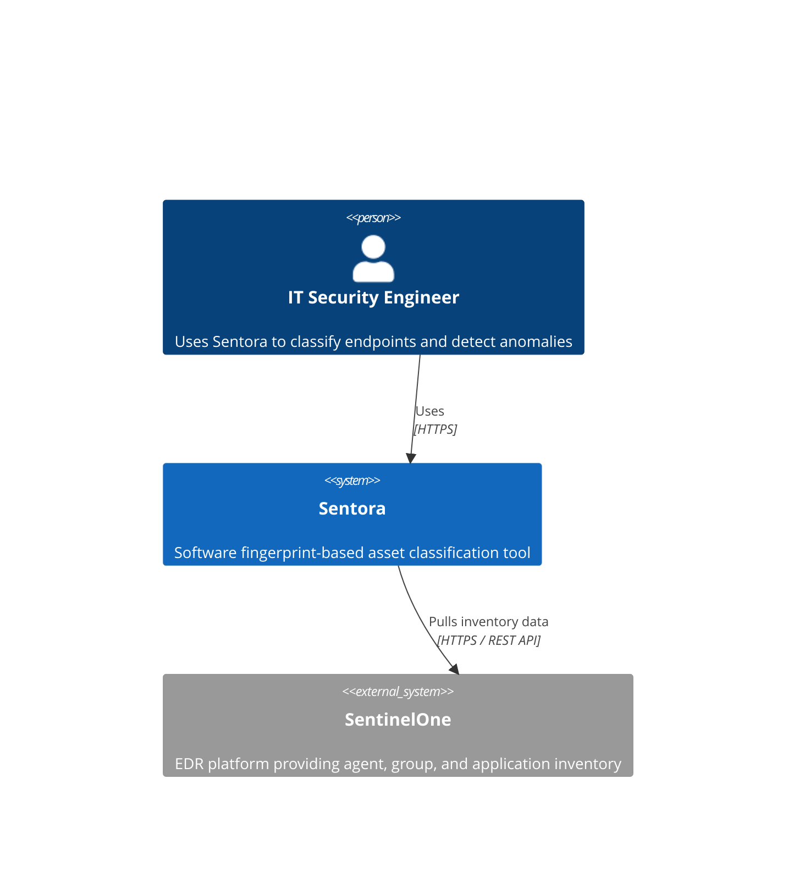
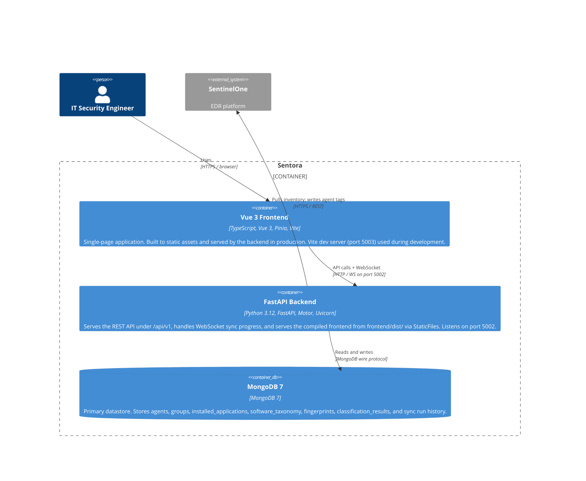

# Architecture Overview

Sentora is a software fingerprint-based asset classification tool for SentinelOne EDR environments. This document describes the system architecture at three levels of the C4 model: System Context, Container, and Component.

---

## System Context

Sentora sits between SentinelOne (an external EDR platform) and the IT security team that needs to audit, classify, and monitor software running across an endpoint fleet.

**Actors and systems:**

| Actor / System | Role |
|---|---|
| IT Security Engineer | Uses the Sentora web UI to build fingerprints, trigger syncs, review classification results, investigate anomalies, and manage tag rules |
| SentinelOne | External EDR platform. Sentora calls the SentinelOne Management API (v2.1) to pull group, agent, and installed-application data. When tag rules are applied, Sentora writes agent tags back to S1 via the manage-tags action endpoint. |
| Sentora | Ingests inventory data, scores applications against fingerprint definitions, stores results, presents a classification dashboard, and can push agent tags back to SentinelOne |

---

## Container Diagram

In production Sentora is a three-container system: a FastAPI backend, a compiled Vue 3 frontend (served by the backend), and MongoDB.

**Container responsibilities:**

| Container | Technology | Port | Responsibility |
|---|---|---|---|
| FastAPI Backend | Python 3.12, FastAPI, Uvicorn | 5002 | REST API, WebSocket, static file serving, S1 client, classification engine |
| Vue 3 Frontend | TypeScript, Vue 3, Pinia, Vue Router, Tailwind CSS v4 | 5003 (dev only) | Browser-side SPA — fingerprint editor, dashboard, classification views |
| MongoDB 7 | MongoDB 7, Motor async driver | 27017 | All persistent state — inventory, fingerprints, classification results, taxonomy |

### Single-Server Serving Model

In production the Vue 3 frontend is compiled (`npm run build`) into static assets in `frontend/dist/`. The FastAPI backend mounts this directory and serves it directly:

- `/assets/*` is handled by a `StaticFiles` mount pointing at `frontend/dist/assets/`. Vite generates content-hashed filenames in this directory, so they can be cached aggressively.
- All other paths that do not match an API route fall through to a catch-all route (`/{full_path:path}`) which returns `frontend/dist/index.html`, enabling Vue Router's history-mode client-side navigation.

This means a single `uvicorn` process serves both the API and the UI with no reverse proxy or separate static file server required.

During development, the Vite dev server runs on port 5003 with hot module replacement. FastAPI opens a CORS exception for `http://localhost:5003` when `APP_ENV=development`. API requests from the Vite dev server proxy to `http://localhost:5002`.

---

## Component Diagram

Within the FastAPI backend, the application is structured as bounded contexts. Each context owns its router, service layer, repository, entities, and DTOs.

```mermaid
graph TD
    subgraph "FastAPI Backend"
        direction TB
        subgraph "Sync Context"
            SR[router.py] --> SS[service.py]
            SS --> SMGR[manager.py]
            SS --> SREP[repository.py]
        end
        subgraph "Taxonomy Context"
            TR[router.py] --> TS[service.py]
            TS --> TREP[repository.py]
        end
        subgraph "Fingerprint Context"
            FR[router.py] --> FS[service.py]
            FS --> FREP[repository.py]
        end
        subgraph "Classification Context"
            CR[router.py] --> CS[service.py]
            CS --> CREP[repository.py]
        end
        subgraph "Library Context"
            LR[router.py] --> LS[service.py]
            LS --> LREP[repository.py]
            LS --> IMGR[ingestion_manager.py]
        end
        subgraph "Auth Context"
            AR[router.py] --> AS[service.py]
            AS --> AREP[repository.py]
        end
        subgraph "Compliance Context"
            COMPR[router.py] --> COMPS[service.py]
            COMPS --> COMPREP[repository.py]
            COMPS --> CHK[checks.py]
        end
        subgraph "Enforcement Context"
            ER[router.py] --> ES[service.py]
            ES --> EREP[repository.py]
            ES --> ENG[engine.py]
        end
        MW[Middleware\nAuth / Logging / RateLimit / ErrorHandler]
        DB[(Motor / MongoDB)]
    end

    MW --> SR & TR & FR & CR & LR & AR & COMPR & ER & AKR & WBR & AGR & DR
    SMGR -->|S1 REST API| S1[SentinelOne]
    IMGR -->|Public APIs| PUB[NVD / MITRE / Registries]
    SREP & TREP & FREP & CREP & LREP & AREP & COMPREP & EREP & AKREP & WBREP & AGREP & DREP --> DB

    subgraph "API Keys Context"
        AKR[router.py] --> AKS[service.py]
        AKS --> AKREP[repository.py]
    end
    subgraph "Webhooks Context"
        WBR[router.py] --> WBS[service.py]
        WBS --> WBREP[repository.py]
    end
    subgraph "Agents Context"
        AGR[router.py] --> AGREP[repository.py]
    end
    subgraph "Dashboard Context"
        DR[router.py] --> DREP[repository.py]
    end
```

**Bounded context responsibilities:**

| Context | Router prefix | Responsibility |
|---|---|---|
| Sync | `/api/v1/sync` | Triggers and tracks SentinelOne data ingestion across 5 phases (sites, groups, agents, apps, tags). The `SyncManager` singleton runs the pipeline as a non-blocking `asyncio` background task and broadcasts progress over WebSocket (`/api/v1/sync/progress`). Sync runs are persisted to MongoDB. |
| Agents | `/api/v1/agents`, `/api/v1/apps`, `/api/v1/groups`, `/api/v1/sites` | Read-only access to synced inventory: agents, installed applications, groups, sites. Provides materialized app summaries for the Applications overview. |
| Taxonomy | `/api/v1/taxonomy` | CRUD for the software catalog. Entries are seeded from a bundled YAML on first startup; users can add and edit entries via the API. |
| Fingerprint | `/api/v1/fingerprints` | CRUD for fingerprint definitions. Each fingerprint targets a SentinelOne group and contains weighted markers. TF-IDF suggestions and discriminative-lift auto-proposer. Exposes pattern-preview endpoints to test glob patterns against live inventory data. |
| Classification | `/api/v1/classification` | Scores each agent's installed-application list against all fingerprints and assigns a verdict (`correct`, `misclassified`, `ambiguous`, `unclassifiable`). Results are stored per-agent and can be acknowledged. |
| Tags | `/api/v1/tags` | CRUD for tag rules. Each rule pairs a tag name with a set of glob patterns; any agent whose installed apps match any pattern receives the tag. Provides a preview endpoint to inspect matches before committing, and an apply endpoint that pushes tags to S1 agents via `POST /agents/actions/manage-tags`. |
| Library | `/api/v1/library` | Shared fingerprint library with reusable templates. Entries are created manually or ingested from public sources (NIST CPE, MITRE ATT&CK, Chocolatey, Homebrew). Groups subscribe to entries; markers are auto-synced into group fingerprints with version-based stale detection. |
| Auth | `/api/v1/auth` | JWT authentication with refresh token rotation, RBAC (super_admin/admin/analyst/viewer), optional TOTP 2FA, OIDC and SAML SSO. Server-side session registry with immediate invalidation. Family-based revocation for stolen-token detection. Account lifecycle management. |
| API Keys | `/api/v1/api-keys` | Tenant-scoped API keys for external integrations (SIEM, dashboards, automation). CRUD with one-time key display, scope-based access control (14 scopes), per-key rate limiting, and key rotation with 5-minute grace period. Management restricted to admin JWT users. |
| Compliance | `/api/v1/compliance` | Continuous compliance monitoring across SOC 2 Type II, PCI DSS 4.0.1, HIPAA Security Rule, and BSI IT-Grundschutz. 61 built-in controls, custom controls, configurable scheduling, evidence snapshots with 90-day TTL. |
| Enforcement | `/api/v1/enforcement` | Software policy enforcement using taxonomy categories. Rule types: Required (must be present), Forbidden (must be absent), Allowlist (only approved). Scoped to groups/tags. Violations trigger webhook notifications. |
| Webhooks | `/api/v1/webhooks` | CRUD for webhook endpoint registrations. Event-driven notifications for sync, classification, compliance, and enforcement events. HMAC-SHA256 signed payloads. Auto-disabling after 10 consecutive failures. |
| Dashboard | `/api/v1/dashboard` | Aggregated fleet health metrics: agent counts, classification coverage, compliance posture, enforcement violations. |
| Config | `/api/v1/config` | Persisted tunable thresholds and scheduler settings, hot-reloadable without restart. |
| Audit | `/api/v1/audit` | Immutable append-only audit log with optional SHA-256 hash-chain for tamper detection. WebSocket live stream. 90-day TTL auto-cleanup. |
| Admin | `/api/v1/admin` | Backup and restore operations for MongoDB data. |
| Tenant | `/api/v1/tenants` | Tenant management (SaaS mode only). Create, list, enable/disable tenants with database-per-tenant isolation. |

**Within each context**, the layering convention is:

- `router.py` — FastAPI route handlers. No business logic. Validates input via Pydantic DTOs, delegates to the service, returns DTOs.
- `service.py` — Orchestration and business logic. Calls the repository. May call other context services through explicit parameters (not imports of other domains' singletons).
- `repository.py` — All MongoDB access. Returns and accepts domain entities. No business logic.
- `entities.py` — Pydantic models that mirror the MongoDB document shape.
- `dto.py` — Request and response models for the HTTP boundary.

**Cross-context policy:** contexts reference each other by ID only. No embedded documents cross context boundaries and no context imports another context's entities or repositories.

---

## Infrastructure Layer

| Component | Role |
|---|---|
| `config.py` | Pydantic `Settings` loaded from environment variables (`.env` file or process environment). Cached as a singleton via `@lru_cache`. |
| `database.py` | Motor `AsyncIOMotorClient` connection pool. `connect_db()` / `close_db()` called from FastAPI lifespan. `get_db()` returns the database handle. |
| `errors.py` | Domain-specific exception hierarchy rooted at `SentoraError`. All exceptions carry an HTTP status code and a machine-readable `error_code`. |
| `middleware/error_handler.py` | Converts `SentoraError` (and unhandled exceptions) to consistent JSON error responses. |
| `middleware/request_logging.py` | Logs every request with method, path, status code, duration, and a correlation ID (taken from `X-Request-ID` header or generated). |

---

## Technology Decisions

For the rationale behind technology choices see the ADR directory at `docs/adr/`. Notable decisions:

- [ADR-0001](../adr/0001-use-mongodb-over-postgresql.md) — MongoDB over PostgreSQL: S1 API payloads map directly to MongoDB documents; embedded app arrays allow per-agent queries with a single document read; no cross-bounded-context joins are required.
