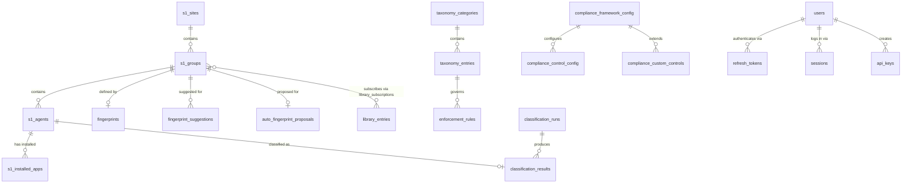

# Data Model

Database: **MongoDB 7** via **Motor** (async driver).
Default database name: `sentora` (configurable via `MONGO_DB` env var).

---

## Collections

### s1_agents

Stores one document per SentinelOne endpoint agent.

| Field | Type | Description |
|-------|------|-------------|
| `_id` | ObjectId | MongoDB auto-generated |
| `s1_agent_id` | string | SentinelOne agent ID (unique) |
| `hostname` | string | Computer name from S1 |
| `os_type` | string | Lowercase OS family: `windows`, `linux`, `macos` |
| `os_version` | string | Full OS version string (e.g. "Windows 10 19045") |
| `group_id` | string | S1 group ID the agent belongs to |
| `group_name` | string | Denormalized group display name |
| `site_id` | string | S1 site ID |
| `site_name` | string | Denormalized site name |
| `network_status` | string | `connected`, `disconnected`, `connecting` |
| `last_active` | string | ISO 8601 timestamp of last activity |
| `machine_type` | string | `desktop`, `laptop`, `server`, `vm` |
| `domain` | string? | Windows domain name |
| `ip_addresses` | string[] | IPv4/IPv6 addresses from network interfaces |
| `tags` | string[] | Flattened S1 tag values |
| `installed_app_names` | string[] | Denormalized normalized app names (for fast classification) |

**Indexes:**
- `s1_agent_id` (unique)
- `site_id`
- `group_id`
- `hostname`
- `last_active`
- `installed_app_names`
- `tags`

---

### s1_installed_apps

One document per installed application record from SentinelOne.

| Field | Type | Description |
|-------|------|-------------|
| `_id` | ObjectId | MongoDB auto-generated |
| `id` | string | S1 app record ID (unique, sparse) |
| `agent_id` | string | S1 agent ID this app belongs to |
| `name` | string | Original app name from S1 |
| `normalized_name` | string | Lowercase, version-stripped, diacritics removed |
| `version` | string? | Application version |
| `publisher` | string? | Software publisher |
| `size` | number? | Install size in bytes |
| `installed_at` | string? | ISO 8601 install timestamp |
| `os_type` | string? | OS type from S1 |
| `app_type` | string? | Application type from S1 |
| `risk_level` | string? | S1 risk assessment level |
| `s1_updated_at` | string? | S1 record updated timestamp |
| `s1_created_at` | string? | S1 record created timestamp |
| `synced_at` | string | ISO 8601 timestamp of the sync that wrote this |
| `last_synced_at` | string | Most recent sync timestamp (for stale cleanup) |
| `active` | boolean | Whether the app record is still current |

**Indexes:**
- `id` (unique, sparse)
- `agent_id`
- `normalized_name`
- (`agent_id`, `normalized_name`) compound
- (`normalized_name`, `agent_id`) compound
- `last_synced_at`
- `publisher`
- `risk_level`
- `active` (sparse)

---

### s1_groups

One document per SentinelOne group.

| Field | Type | Description |
|-------|------|-------------|
| `_id` | ObjectId | MongoDB auto-generated |
| `s1_group_id` | string | S1 group ID (unique) |
| `name` | string | Group display name |
| `description` | string? | Group description |
| `type` | string | Group type (e.g. `static`, `dynamic`) |
| `is_default` | boolean | Whether this is the site default group |
| `filter_name` | string? | Dynamic group filter name |
| `agent_count` | number | Total agents reported by S1 |
| `site_id` | string | Parent site ID |
| `site_name` | string | Denormalized site name |
| `created_at` | string? | S1 creation timestamp |
| `updated_at` | string? | S1 updated timestamp |

**Indexes:**
- `s1_group_id` (unique)
- `site_id`

---

### s1_sites

One document per SentinelOne site.

| Field | Type | Description |
|-------|------|-------------|
| `_id` | ObjectId | MongoDB auto-generated |
| `s1_site_id` | string | S1 site ID (unique) |
| `name` | string | Site display name |
| `state` | string | Site state |
| `site_type` | string | Site type |
| `account_id` | string | S1 account ID |
| `account_name` | string | S1 account name |

**Indexes:**
- `s1_site_id` (unique)
- `name`

---

### s1_tags

One document per SentinelOne tag definition.

| Field | Type | Description |
|-------|------|-------------|
| `_id` | ObjectId | MongoDB auto-generated |
| `s1_tag_id` | string | S1 tag ID (unique) |
| `name` | string | Tag name |
| `description` | string? | Tag description |
| `type` | string | Tag type |
| `scope` | string | Tag scope |
| `creator` | string? | Who created the tag |
| `created_at` | string? | S1 creation timestamp |
| `updated_at` | string? | S1 updated timestamp |
| `synced_at` | string | When this tag was last synced |

**Indexes:**
- `s1_tag_id` (unique)
- `name`
- `scope`

---

### s1_sync_runs

One document per sync execution (full, incremental, per-phase).

| Field | Type | Description |
|-------|------|-------------|
| `_id` | string (UUID) | Sync run identifier |
| `started_at` | string | ISO 8601 start timestamp |
| `completed_at` | string? | ISO 8601 completion timestamp |
| `status` | string | `running`, `completed`, `failed` |
| `trigger` | string | `manual`, `scheduled`, `resume`, `refresh` |
| `mode` | string | `full`, `incremental`, `auto` |
| `phases` | string[] | Which phases were requested |
| `counts` | object | Nested: `sites_synced/total`, `groups_synced/total`, `agents_synced/total`, `apps_synced/total`, `tags_synced/total`, `errors` |
| `error_log` | string[] | Error messages |
| `phase` | string? | Current phase: `sites`, `groups`, `agents`, `apps`, `tags`, `done` |
| `message` | string? | Human-readable status message |

**Indexes:**
- (`status`, `completed_at` desc) compound
- (`started_at` desc)

---

### s1_sync_meta

Singleton document (`_id: "global"`) tracking global sync state.

| Field | Type | Description |
|-------|------|-------------|
| `_id` | string | Always `"global"` |
| `last_completed_at` | string | ISO 8601 timestamp of last successful sync |
| `last_agent_updated_at` | string | Cursor for incremental agent sync |
| `last_app_installed_at` | string | Cursor for incremental app refresh |

No explicit indexes (singleton document).

---

### s1_sync_checkpoint

Singleton document (`_id: "current"`) for resumable sync state. Deleted on successful completion.

| Field | Type | Description |
|-------|------|-------------|
| `_id` | string | Always `"current"` |
| `run_id` | string | ID of the in-progress sync run |
| `phases_done` | string[] | Phases completed before failure |
| `started_at` | string | When the run started |
| `counts` | object | Running sync counts at time of checkpoint |

No explicit indexes (singleton document).

---

### classification_results

One document per agent, upserted on each classification run.

| Field | Type | Description |
|-------|------|-------------|
| `_id` | ObjectId | Auto-generated (string representation used as `id`) |
| `run_id` | string | ID of the ClassificationRun that produced this result |
| `agent_id` | string | S1 agent ID (unique) |
| `hostname` | string | Denormalized agent hostname |
| `current_group_id` | string | Agent's current S1 group |
| `current_group_name` | string | Denormalized group name |
| `match_scores` | GroupMatchScore[] | Top-5 fingerprint match results (see below) |
| `classification` | string | Verdict: `correct`, `misclassified`, `ambiguous`, `unclassifiable` |
| `suggested_group_id` | string? | Suggested correct group (misclassified only) |
| `suggested_group_name` | string? | Denormalized suggested group name |
| `anomaly_reasons` | string[] | Human-readable anomaly descriptions |
| `computed_at` | datetime | When this result was computed |
| `acknowledged` | boolean | Whether an operator has reviewed this |

**GroupMatchScore embedded document:**
- `group_id`: string
- `group_name`: string
- `score`: float (0.0-1.0)
- `matched_markers`: string[]
- `missing_markers`: string[]

**Indexes:**
- `agent_id` (unique)
- `classification`
- `current_group_id`
- `run_id`
- `hostname`
- `acknowledged`
- (`computed_at` desc)

---

### classification_runs

One document per classification pipeline execution.

| Field | Type | Description |
|-------|------|-------------|
| `_id` | ObjectId | Auto-generated |
| `started_at` | datetime | When the run started |
| `completed_at` | datetime? | When the run finished |
| `status` | string | `running`, `completed`, `failed` |
| `trigger` | string | `manual`, `scheduled` |
| `agents_classified` | number | Agents successfully classified |
| `errors` | number | Agents that errored |
| `error_log` | string[] | Error messages |

**Indexes:**
- (`started_at` desc)
- `status`

---

### fingerprints

One document per group fingerprint (one-to-one with a group).

| Field | Type | Description |
|-------|------|-------------|
| `_id` | ObjectId | Auto-generated |
| `group_id` | string | S1 group ID (unique) |
| `group_name` | string | Denormalized group name |
| `site_name` | string | Denormalized site name |
| `account_name` | string | Denormalized account name |
| `markers` | FingerprintMarker[] | Ordered list of pattern markers (see below) |
| `created_at` | datetime | Creation timestamp |
| `updated_at` | datetime | Last update timestamp |
| `created_by` | string | Creator identifier |

**FingerprintMarker embedded document:**
- `_id`: string (ObjectId)
- `pattern`: string (glob pattern)
- `display_name`: string
- `category`: string (default `"name_pattern"`)
- `weight`: float (0.1-2.0, default 1.0)
- `source`: `"manual"` | `"statistical"` | `"seed"` | `"library"`
- `confidence`: float (0.0-1.0)
- `added_at`: datetime
- `added_by`: string

**Indexes:**
- `group_id` (unique)

---

### fingerprint_suggestions

TF-IDF-derived suggestions for fingerprint markers. Multiple per group.

| Field | Type | Description |
|-------|------|-------------|
| `_id` | ObjectId | Auto-generated |
| `group_id` | string | Target S1 group ID |
| `normalized_name` | string | Lowercase normalized app name |
| `display_name` | string | Human-readable app name |
| `score` | float | TF-IDF relevance score |
| `group_coverage` | float | Fraction of in-group agents with this app |
| `outside_coverage` | float | Fraction of out-of-group agents with this app |
| `agent_count_in_group` | number | Absolute in-group count |
| `agent_count_outside` | number | Absolute out-of-group count |
| `status` | string | `pending`, `accepted`, `rejected` |
| `computed_at` | datetime | When the suggestion was computed |

**Indexes:**
- `group_id`
- (`group_id`, `status`) compound
- (`group_id`, `score` desc) compound

---

### auto_fingerprint_proposals

One document per group, upserted on each proposal generation run.

| Field | Type | Description |
|-------|------|-------------|
| `_id` | ObjectId | Auto-generated |
| `group_id` | string | Target S1 group ID (unique) |
| `group_name` | string | Group display name |
| `group_size` | number | Number of agents in the group |
| `proposed_markers` | ProposedMarker[] | Ranked list of markers (see below) |
| `quality_score` | float | Mean lift across proposed markers |
| `total_groups` | number | Total groups analyzed in this run |
| `coverage_min` | float | Threshold used |
| `outside_max` | float | Threshold used |
| `lift_min` | float | Threshold used |
| `top_k` | number | Max markers cap used |
| `status` | string | `pending`, `applied`, `dismissed` |
| `computed_at` | datetime | When the proposal was computed |

**ProposedMarker embedded document:**
- `normalized_name`: string
- `display_name`: string
- `lift`: float
- `group_coverage`: float
- `outside_coverage`: float
- `agent_count_in_group`: number
- `agent_count_outside`: number
- `shared_with_groups`: string[]

**Indexes:**
- `group_id` (unique)
- `status`
- (`quality_score` desc)

---

### app_summaries

Materialized view: one document per distinct normalized app name. Rebuilt after each sync and taxonomy mutation.

| Field | Type | Description |
|-------|------|-------------|
| `_id` | ObjectId | Auto-generated |
| `normalized_name` | string | Lowercase app name (unique) |
| `display_name` | string | Best human-readable name |
| `publisher` | string? | Most common publisher |
| `agent_count` | number | Number of agents with this app |
| `category` | string? | Resolved taxonomy category key |
| `category_display` | string? | Resolved taxonomy category label |

**Indexes:**
- `normalized_name` (unique)
- `agent_count`
- `category`

---

### taxonomy_categories

One document per software taxonomy category.

| Field | Type | Description |
|-------|------|-------------|
| `_id` | ObjectId | Auto-generated |
| `key` | string | Category slug (unique, e.g. `scada_hmi`) |
| `display` | string | Human-readable label |
| `entry_count` | number | Number of entries in this category |

**Indexes:**
- `key` (unique)

---

### taxonomy_entries

One document per software entry in the taxonomy catalog.

| Field | Type | Description |
|-------|------|-------------|
| `_id` | ObjectId | Auto-generated |
| `name` | string | Display name (e.g. "Siemens WinCC") |
| `patterns` | string[] | Glob patterns matched against `normalized_name` |
| `publisher` | string? | Software publisher |
| `category` | string | Category key |
| `category_display` | string | Human-readable category label |
| `subcategory` | string? | Finer sub-grouping |
| `industry` | string[] | Industry tags |
| `description` | string? | Free-text description |
| `is_universal` | boolean | Excluded from fingerprint suggestions |
| `user_added` | boolean | `false` for seed data, `true` for user-created |
| `created_at` | datetime | Creation timestamp |
| `updated_at` | datetime | Last update timestamp |

**Indexes:**
- `category`
- `name`
- (`name`, `patterns`) text index

---

### tag_rules

One document per tag rule that maps glob patterns to S1 tags.

| Field | Type | Description |
|-------|------|-------------|
| `_id` | ObjectId | Auto-generated |
| `tag_name` | string | S1 tag key to apply (unique) |
| `description` | string | Rule description |
| `patterns` | TagRulePattern[] | Glob patterns (see below) |
| `apply_status` | string | `idle`, `running`, `done`, `failed` |
| `last_applied_at` | datetime? | Last successful apply timestamp |
| `last_applied_count` | number | Agents tagged in last apply |
| `created_at` | datetime | Creation timestamp |
| `updated_at` | datetime | Last update timestamp |
| `created_by` | string | Creator identifier |

**TagRulePattern embedded document:**
- `_id`: string (ObjectId)
- `pattern`: string (glob)
- `display_name`: string
- `category`: string (default `"name_pattern"`)
- `source`: `"manual"` | `"seed"`
- `added_at`: datetime
- `added_by`: string

**Indexes:**
- `tag_name` (unique)
- `apply_status`
- (`updated_at` desc)

---

### audit_log

Append-only log of significant system events. Auto-expires after 90 days via TTL index.

| Field | Type | Description |
|-------|------|-------------|
| `_id` | ObjectId | Auto-generated |
| `timestamp` | string | ISO 8601 event timestamp |
| `actor` | string | Who initiated: `user`, `system`, `scheduler` |
| `domain` | string | Functional area: `sync`, `config`, `fingerprint`, etc. |
| `action` | string | Event type: `sync.completed`, `config.updated`, etc. |
| `status` | string | `success`, `failure`, `info` |
| `summary` | string | Human-readable one-line description |
| `details` | object | Structured metadata (counts, changed fields, etc.) |
| `created_at` | datetime | Used by TTL index for auto-deletion |

**Indexes:**
- (`timestamp` desc)
- `domain`
- `actor`
- `action`
- `status`
- `created_at` (TTL: 90 days)

---

### library_entries

Shared fingerprint templates in the public library. Each entry contains reusable glob-pattern markers that can be subscribed to by S1 groups.

| Field | Type | Description |
|-------|------|-------------|
| `_id` | string (ObjectId) | Document identifier |
| `name` | string | Human-readable name (e.g. "Google Chrome") |
| `vendor` | string | Software vendor/publisher |
| `category` | string | Taxonomy category key |
| `description` | string | Free-text description |
| `tags` | string[] | Free-form tags for filtering |
| `markers` | LibraryMarker[] | Glob-pattern markers (see below) |
| `source` | string | `manual`, `nist_cpe`, `mitre`, `chocolatey`, `winget`, `homebrew`, `community` |
| `upstream_id` | string? | External identifier (CPE URI, MITRE ID, etc.) |
| `upstream_version` | string? | Version of upstream data at creation |
| `version` | number | Internal version, bumped on each update (for subscription sync) |
| `status` | string | `draft`, `pending_review`, `published`, `deprecated` |
| `subscriber_count` | number | Denormalized count of subscribing groups |
| `submitted_by` | string | Creator identifier |
| `reviewed_by` | string? | Reviewer identifier |
| `created_at` | datetime | Creation timestamp |
| `updated_at` | datetime | Last update timestamp |

**LibraryMarker embedded document:**
- `_id`: string (ObjectId)
- `pattern`: string (glob pattern)
- `display_name`: string
- `category`: string (default `"name_pattern"`)
- `weight`: float (default 1.0)
- `source_detail`: string (provenance detail)
- `added_at`: datetime
- `added_by`: string

**Indexes:**
- `name`
- `vendor`
- `category`
- `source`
- `status`
- `tags`
- (`source`, `upstream_id`) unique sparse — prevents duplicate ingestion
- (`subscriber_count` desc, `name`) — popular entries first
- (`name`, `vendor`, `description`) text index — full-text search

---

### library_subscriptions

Links library entries to S1 groups. When subscribed, the entry's markers are copied into the group's fingerprint with `source="library"`.

| Field | Type | Description |
|-------|------|-------------|
| `_id` | string (ObjectId) | Document identifier |
| `group_id` | string | S1 group ID |
| `library_entry_id` | string | Library entry ID |
| `synced_version` | number | Entry version last synced to the group |
| `auto_update` | boolean | Whether to auto-sync on entry updates |
| `subscribed_at` | datetime | Subscription creation timestamp |
| `subscribed_by` | string | Who subscribed |
| `last_synced_at` | datetime? | Last sync timestamp |

**Indexes:**
- (`group_id`, `library_entry_id`) unique — one subscription per group-entry pair
- `group_id`
- `library_entry_id`

---

### library_ingestion_runs

Tracks source ingestion run history (NIST CPE, MITRE ATT&CK, Chocolatey, Homebrew).

| Field | Type | Description |
|-------|------|-------------|
| `_id` | string (ObjectId) | Document identifier |
| `source` | string | Adapter name (e.g. `nist_cpe`, `mitre`) |
| `status` | string | `running`, `completed`, `failed` |
| `started_at` | datetime | Run start timestamp |
| `completed_at` | datetime? | Run completion timestamp |
| `entries_created` | number | New library entries created |
| `entries_updated` | number | Existing entries updated |
| `entries_skipped` | number | Entries skipped (no changes) |
| `errors` | string[] | Error messages |

**Indexes:**
- (`started_at` desc)
- `source`

---

### app_config

Singleton document (`_id: "global"`) holding tunable application settings.

| Field | Type | Description |
|-------|------|-------------|
| `_id` | string | Always `"global"` |
| `classification_threshold` | float | Score >= this = `correct` (default 0.70) |
| `partial_threshold` | float | Score >= this = `ambiguous` (default 0.40) |
| `ambiguity_gap` | float | Min gap between top two scores (default 0.15) |
| `universal_app_threshold` | float | Fleet coverage to consider universal (default 0.60) |
| `suggestion_score_threshold` | float | Min TF-IDF score for suggestions (default 0.50) |
| `page_size_agents` | number | Agents per page from S1 API (default 500) |
| `page_size_apps` | number | Apps per page from S1 API (default 500) |
| `page_size_audit` | number | Audit log page size (default 100) |
| `refresh_interval_minutes` | number | Auto-refresh interval, 0=disabled (default 60) |
| `proposal_coverage_min` | float | Min in-group coverage for proposals (default 0.60) |
| `proposal_outside_max` | float | Max outside coverage for proposals (default 0.25) |
| `proposal_lift_min` | float | Min lift score for proposals (default 2.0) |
| `proposal_top_k` | number | Max markers per group proposal (default 100) |
| `library_ingestion_enabled` | boolean | Enable background library ingestion (default false) |
| `library_ingestion_interval_hours` | number | Hours between ingestion runs (default 24, range 1-168) |
| `library_ingestion_sources` | string[] | Enabled source adapter names |
| `updated_at` | string | ISO 8601 last update timestamp |

No explicit indexes (singleton document).

---

### webhooks

Stores webhook endpoint registrations for event-driven notifications.

| Field | Type | Description |
|-------|------|-------------|
| `_id` | ObjectId | Auto-generated |
| `name` | string | Human-readable webhook name |
| `url` | string | Target URL for event delivery |
| `events` | string[] | Subscribed event types (e.g. `sync.completed`, `classification.anomaly_detected`) |
| `secret` | string | HMAC-SHA256 signing secret |
| `enabled` | boolean | Whether the webhook is active |
| `created_at` | datetime | Creation timestamp |
| `last_triggered_at` | datetime? | Last successful delivery timestamp |
| `failure_count` | number | Consecutive delivery failures |
| `last_error` | string? | Most recent delivery error message |

No explicit indexes (small collection, queried by `_id`).

---

### api_keys

Stores tenant-scoped API keys for external integrations (SIEM, dashboards, automation).

| Field | Type | Description |
|-------|------|-------------|
| `_id` | string (ObjectId) | Internal key identifier |
| `tenant_id` | string | Tenant this key belongs to |
| `name` | string | Human-readable label (e.g. "Splunk Integration") |
| `description` | string? | Optional longer description |
| `key_prefix` | string | First 20 characters of the key (for UI identification) |
| `key_hash` | string | SHA-256 hash of the full key (only stored form) |
| `scopes` | string[] | Granted permission scopes (e.g. `["agents:read", "apps:read"]`) |
| `rate_limit_per_minute` | number | Max requests per minute for this key (default 60) |
| `rate_limit_per_hour` | number | Max requests per hour for this key (default 1000) |
| `created_at` | datetime | Creation timestamp |
| `created_by` | string | Username of the creator |
| `expires_at` | datetime? | Optional expiration timestamp |
| `last_used_at` | datetime? | Most recent usage timestamp |
| `last_used_ip` | string? | IP of most recent usage |
| `is_active` | boolean | Whether the key is currently usable |
| `revoked_at` | datetime? | When the key was revoked |
| `revoked_by` | string? | Username of the revoker |
| `grace_expires_at` | datetime? | Grace period expiry after rotation |
| `rotated_from_id` | string? | ID of the key this was rotated from |

**Indexes:**
- `key_hash` (unique) — primary lookup on every API key auth request
- `tenant_id`
- (`tenant_id`, `is_active`) compound
- `grace_expires_at` (sparse)
- (`created_at` desc)

---

### compliance_framework_config

One document per compliance framework, controlling whether it is enabled for this tenant.

| Field | Type | Description |
|-------|------|-------------|
| `_id` | ObjectId | Auto-generated |
| `framework_id` | string | Framework identifier (unique): `soc2`, `pci_dss`, `hipaa`, `bsi` |
| `enabled` | boolean | Whether this framework is active |
| `updated_at` | datetime | Last update timestamp |
| `updated_by` | string | Who last modified the config |

**Indexes:**
- `framework_id` (unique)

---

### compliance_control_config

Per-control configuration overrides within a framework.

| Field | Type | Description |
|-------|------|-------------|
| `_id` | ObjectId | Auto-generated |
| `control_id` | string | Control identifier |
| `framework_id` | string | Parent framework ID |
| `enabled` | boolean | Whether this control is active |
| `severity_override` | string? | Override severity: `critical`, `high`, `medium`, `low` |
| `parameters_override` | object? | Custom threshold overrides |
| `scope_tags_override` | string[]? | Limit control to agents with these S1 tags |
| `scope_groups_override` | string[]? | Limit control to these S1 group IDs |
| `updated_at` | datetime | Last update timestamp |
| `updated_by` | string | Who last modified the config |

**Indexes:**
- (`control_id`, `framework_id`) unique compound
- `framework_id`

---

### compliance_custom_controls

Operator-defined controls that extend a framework's built-in controls.

| Field | Type | Description |
|-------|------|-------------|
| `_id` | ObjectId | Auto-generated |
| `control_id` | string | Unique control identifier |
| `framework_id` | string | Parent framework ID |
| `name` | string | Human-readable control name |
| `description` | string | What the control checks |
| `category` | string | Control category |
| `severity` | string | `critical`, `high`, `medium`, `low` |
| `check_type` | string | Automated check type |
| `parameters` | object | Check-specific parameters |
| `scope_tags` | string[]? | Limit to agents with these S1 tags |
| `scope_groups` | string[]? | Limit to these S1 group IDs |
| `remediation` | string? | Remediation guidance |
| `created_at` | datetime | Creation timestamp |
| `created_by` | string | Creator identifier |

**Indexes:**
- `control_id` (unique)
- `framework_id`

---

### compliance_results

Snapshot of a single control check within a compliance run. Auto-expires after 90 days.

| Field | Type | Description |
|-------|------|-------------|
| `_id` | ObjectId | Auto-generated |
| `run_id` | string | ID of the compliance check run |
| `control_id` | string | Control that was evaluated |
| `framework_id` | string | Parent framework ID |
| `control_name` | string | Denormalized control name |
| `category` | string | Control category |
| `severity` | string | Effective severity at check time |
| `status` | string | `pass`, `fail`, `error`, `not_applicable` |
| `checked_at` | datetime | When the check ran |
| `total_endpoints` | number | Endpoints in scope |
| `compliant_endpoints` | number | Endpoints passing the check |
| `non_compliant_endpoints` | number | Endpoints failing the check |
| `evidence_summary` | string | Human-readable evidence for auditors |
| `violations` | ComplianceViolation[] | Per-endpoint violation details |

**Indexes:**
- `run_id`
- (`control_id`, `checked_at` desc) compound
- `framework_id`
- (`checked_at` desc)
- `status`
- `checked_at` (TTL: 90 days)

---

### compliance_schedule

Singleton document (`_id: "schedule"`) controlling automated compliance check scheduling.

| Field | Type | Description |
|-------|------|-------------|
| `_id` | string | Always `"schedule"` |
| `run_after_sync` | boolean | Trigger compliance checks after each sync completes |
| `cron_expression` | string? | Optional cron schedule (e.g. `0 2 * * *`) |
| `enabled` | boolean | Whether scheduled checks are active |
| `updated_at` | datetime | Last update timestamp |
| `updated_by` | string | Who last modified the schedule |

No explicit indexes (singleton document).

---

### enforcement_rules

Defines software policy rules anchored to taxonomy categories.

| Field | Type | Description |
|-------|------|-------------|
| `_id` | ObjectId | Auto-generated |
| `name` | string | Human-readable rule name |
| `taxonomy_category_id` | string | Taxonomy category this rule applies to |
| `type` | string | `required`, `forbidden`, `allowlist` |
| `severity` | string | `critical`, `high`, `medium`, `low` |
| `description` | string | Rule description |
| `enabled` | boolean | Whether the rule is active |
| `scope_groups` | string[]? | Limit to these S1 group IDs |
| `scope_tags` | string[]? | Limit to agents with these S1 tags |
| `labels` | string[] | Free-form labels for filtering |
| `created_at` | datetime | Creation timestamp |
| `updated_at` | datetime | Last update timestamp |
| `created_by` | string | Creator identifier |
| `updated_by` | string | Last modifier |

**Indexes:**
- `enabled`
- `taxonomy_category_id`
- (`created_at` desc)

---

### enforcement_results

Snapshot of a single enforcement rule check. Auto-expires after 90 days.

| Field | Type | Description |
|-------|------|-------------|
| `_id` | ObjectId | Auto-generated |
| `run_id` | string | ID of the enforcement check run |
| `rule_id` | string | Enforcement rule that was evaluated |
| `rule_name` | string | Denormalized rule name |
| `rule_type` | string | `required`, `forbidden`, `allowlist` |
| `severity` | string | Rule severity at check time |
| `checked_at` | datetime | When the check ran |
| `status` | string | `pass`, `fail`, `error` |
| `total_agents` | number | Agents in scope |
| `compliant_agents` | number | Agents passing the check |
| `non_compliant_agents` | number | Agents failing the check |
| `violations` | EnforcementViolation[] | Per-agent violation details |

**Indexes:**
- `run_id`
- (`rule_id`, `checked_at` desc) compound
- (`checked_at` desc)
- `status`
- `checked_at` (TTL: 90 days)

---

### backup_history

Tracks backup job execution history.

| Field | Type | Description |
|-------|------|-------------|
| `_id` | ObjectId | Auto-generated |
| `timestamp` | datetime | When the backup ran |
| `size_bytes` | number | Backup file size |
| `checksum_sha256` | string | SHA-256 checksum of the backup file |
| `storage_type` | string | `local`, `s3` |
| `storage_path` | string | Path or URI of the backup file |
| `status` | string | `completed`, `failed` |
| `triggered_by` | string | Who/what triggered the backup |
| `duration_seconds` | float | Backup duration |
| `error` | string? | Error message if failed |

**Indexes:**
- (`timestamp` desc)
- `status`

---

### leader_election

Coordination collection for multi-worker leader election. Only one worker holds leadership at a time; others back off. Stale claims auto-expire via TTL.

| Field | Type | Description |
|-------|------|-------------|
| `_id` | string | Election name (e.g. `scheduler`) |
| `worker_id` | string | ID of the worker holding leadership |
| `acquired_at` | datetime | When leadership was acquired |
| `expires_at` | datetime | TTL expiration for crash safety |

**Indexes:**
- `expires_at` (TTL: 0 seconds)

---

### oidc_pending_states

Temporary CSRF state tokens for OIDC authentication flows. Auto-expires after 10 minutes.

| Field | Type | Description |
|-------|------|-------------|
| `_id` | string | Random state token |
| `created_at` | datetime | When the state was created |

**Indexes:**
- `created_at` (TTL: 600 seconds)

---

### saml_pending_requests

Temporary CSRF request IDs for SAML authentication flows. Auto-expires after 10 minutes.

| Field | Type | Description |
|-------|------|-------------|
| `_id` | string | SAML AuthnRequest ID |
| `created_at` | datetime | When the request was created |

**Indexes:**
- `created_at` (TTL: 600 seconds)

---

### saml_token_exchange

One-time nonces for exchanging SAML assertions into JWT token pairs. Auto-expires after 5 minutes.

| Field | Type | Description |
|-------|------|-------------|
| `_id` | string | Random nonce |
| `access_token` | string | Pre-generated JWT access token |
| `refresh_token` | string | Pre-generated JWT refresh token |
| `created_at` | datetime | When the exchange was created |

**Indexes:**
- `created_at` (TTL: 300 seconds)

---

### library_ingestion_checkpoint

Per-source watermark for incremental library ingestion. Keyed by `_id = "source:<name>"`.

| Field | Type | Description |
|-------|------|-------------|
| `_id` | string | Source identifier (e.g. `source:nist_cpe`) |
| `last_offset` | string? | Last processed offset or cursor |
| `last_run_at` | datetime? | When the source was last ingested |
| `metadata` | object? | Source-specific checkpoint data |

No explicit indexes (small collection, keyed by `_id`).

---

### users

Stores registered user accounts for JWT authentication.

| Field | Type | Description |
|-------|------|-------------|
| `_id` | ObjectId | MongoDB auto-generated |
| `username` | string | Unique login identifier |
| `email` | string | Unique email address |
| `hashed_password` | string | bcrypt 5.x password hash |
| `role` | string | `super_admin`, `admin`, `analyst`, or `viewer` |
| `disabled` | boolean | Whether the account is deactivated (legacy compat) |
| `status` | string | Account lifecycle: `invited`, `active`, `suspended`, `deactivated`, `deleted` |
| `totp_secret` | string? | TOTP shared secret (set when 2FA is enabled) |
| `totp_enabled` | boolean | Whether TOTP 2FA is active for this user |
| `oidc_subject` | string? | OIDC provider subject identifier (for SSO users) |
| `saml_subject` | string? | SAML provider subject identifier (for SSO users) |
| `tenant_id` | string? | Tenant association (SaaS mode only) |
| `password_history` | array | Last N password hashes `[{hash, set_at}]` for reuse prevention |
| `password_changed_at` | datetime? | Timestamp of most recent password change |
| `failed_login_attempts` | number | Consecutive failed login attempts (resets on success) |
| `locked_until` | datetime? | Account lockout expiry (null if not locked) |
| `known_user_agents` | string[] | Previously seen User-Agent strings (for new device detection) |
| `last_login_ip` | string? | IP address of most recent successful login |
| `last_login_at` | datetime? | Timestamp of most recent successful login |
| `deleted_at` | datetime? | Soft-delete timestamp (compliance retention) |
| `created_at` | datetime | Account creation timestamp |
| `updated_at` | datetime | Last update timestamp |

**Indexes:**
- `username` (unique)
- `email` (unique)
- `oidc_subject` (unique, sparse)
- `saml_subject` (unique, sparse)
- `status`
- `locked_until` (sparse)

---

### sessions

Server-side session registry for immediate token invalidation and device management.
Each login creates a session bound to a refresh token family. The `session_id` is
embedded in JWT access tokens as the `sid` claim.

| Field | Type | Description |
|-------|------|-------------|
| `_id` | ObjectId | MongoDB auto-generated |
| `session_id` | string | Unique session identifier (UUID, indexed unique) |
| `user_id` | string | MongoDB ObjectId of the user (as string) |
| `username` | string | Username for display and lookup |
| `tenant_id` | string? | Tenant context for multi-tenancy |
| `created_at` | datetime | When the session was established |
| `last_active_at` | datetime | Most recent API call using this session |
| `expires_at` | datetime | Absolute session expiry (TTL index) |
| `ip_address` | string | Client IP at session creation |
| `user_agent` | string | Client User-Agent at session creation |
| `is_active` | boolean | Whether the session is still valid |
| `revoked_at` | datetime? | When the session was revoked |
| `revoked_reason` | string? | Why revoked: `logout`, `admin_revoked`, `password_changed`, etc. |
| `refresh_token_family` | string | Links session to the refresh token rotation chain |

**Indexes:**
- `session_id` (unique)
- `username`
- (`username`, `is_active`) compound
- `refresh_token_family`
- `expires_at` (TTL: 0 seconds — auto-expire)
- (`is_active`, `revoked_at`) compound (for cache refresh queries)

---

### refresh_tokens

Stores refresh token metadata for JWT token rotation. Each refresh token belongs to a family; when a token is reused after rotation, the entire family is revoked (stolen-token detection).

| Field | Type | Description |
|-------|------|-------------|
| `_id` | ObjectId | MongoDB auto-generated |
| `token_id` | string | Unique token identifier (UUID, indexed unique) |
| `family_id` | string | Token family ID — all tokens in a rotation chain share the same family |
| `username` | string | User this token belongs to |
| `role` | string | Role snapshot at token issuance |
| `revoked` | boolean | Whether this token has been revoked |
| `expires_at` | datetime | TTL index — MongoDB auto-deletes expired tokens |
| `created_at` | datetime | Token creation timestamp |

**Indexes:**
- `token_id` (unique)
- `family_id`
- `username`
- `expires_at` (TTL: 0 seconds — documents deleted when `expires_at` is reached)

---

### distributed_locks

Advisory locks for coordinating singleton operations across processes. Not used in the single-process default deployment but reserved for future multi-worker scaling.

| Field | Type | Description |
|-------|------|-------------|
| `_id` | string | Lock name (e.g. `sync`, `classification`) |
| `holder` | string | Process/worker identifier |
| `acquired_at` | datetime | When the lock was acquired |
| `expires_at` | datetime | TTL expiration for crash safety |

---

## Entity Relationships



### Relationship summary

```
Account (from S1, denormalized on sites/agents)
  └── s1_sites (1:N)
       └── s1_groups (1:N)
            ├── s1_agents (1:N, via group_id)
            │    ├── s1_installed_apps (1:N, via agent_id)
            │    └── classification_results (1:1, via agent_id)
            ├── fingerprints (1:1, via group_id)
            ├── fingerprint_suggestions (1:N, via group_id)
            └── auto_fingerprint_proposals (1:1, via group_id)

taxonomy_categories (1:N) ── taxonomy_entries (via category key)
enforcement_rules ── taxonomy_categories (via taxonomy_category_id)
tag_rules (standalone, patterns matched against agent installed_app_names)
app_summaries (materialized from s1_installed_apps + taxonomy_entries)

s1_sync_runs (standalone, ordered by started_at)
s1_sync_meta (singleton, global sync cursor state)
s1_sync_checkpoint (singleton, resumable sync state)

classification_runs (1:N) ── classification_results (via run_id)

compliance_framework_config (1:N) ── compliance_control_config (via framework_id)
compliance_framework_config (1:N) ── compliance_custom_controls (via framework_id)
compliance_results (standalone snapshots, TTL 90 days)
compliance_schedule (singleton)

enforcement_rules (standalone, linked to taxonomy_categories)
enforcement_results (standalone snapshots, TTL 90 days)

library_entries (standalone, versioned fingerprint templates)
  └── library_subscriptions (N:M, links library_entries to groups)
library_ingestion_runs (standalone, ordered by started_at)
library_ingestion_checkpoint (per-source watermark singletons)

webhooks (standalone, event-driven notification endpoints)
backup_history (standalone, ordered by timestamp)

app_config (singleton, global settings)
audit_log (append-only, TTL 90 days)

users (1:N) ── refresh_tokens (via username, grouped by family_id)
users (1:N) ── sessions (via username, bound to refresh token families)
users (1:N) ── api_keys (via created_by, scoped to tenant_id)
oidc_pending_states (ephemeral, TTL 10 min)
saml_pending_requests (ephemeral, TTL 10 min)
saml_token_exchange (ephemeral, TTL 5 min)

distributed_locks (advisory, TTL-based)
leader_election (singleton per election, TTL-based)
```

### Key relationship patterns

- **Denormalization**: Group names, site names, and hostnames are copied into referencing documents to avoid joins. They are refreshed on each sync.
- **Upsert keys**: `s1_agent_id`, `group_id` on fingerprints, `agent_id` on classification_results — these enforce one-to-one relationships.
- **Materialized views**: `app_summaries` is rebuilt (drop + bulk insert) after syncs and taxonomy changes.
- **Singletons**: `app_config`, `s1_sync_meta`, `s1_sync_checkpoint`, `compliance_schedule` use fixed `_id` values.
- **TTL collections**: `audit_log` (90 days), `compliance_results` (90 days), `enforcement_results` (90 days), `refresh_tokens` (at expiry), `oidc_pending_states` (10 min), `saml_pending_requests` (10 min), `saml_token_exchange` (5 min), `distributed_locks` (at expiry), `leader_election` (at expiry).
- **Ephemeral auth state**: OIDC/SAML pending state collections are short-lived CSRF protection — they self-clean via TTL and should never be backed up.
