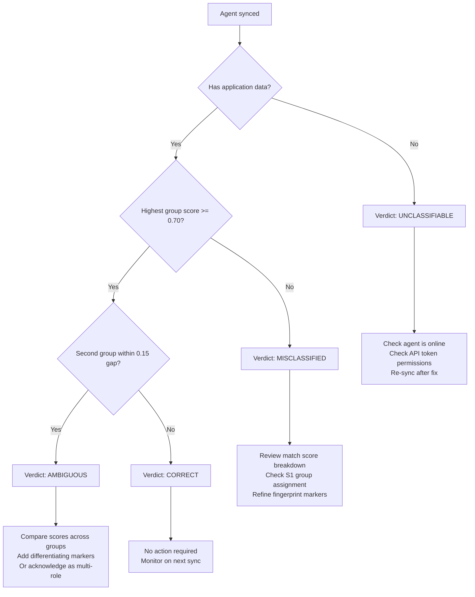

# Interpreting Classification Results

This guide explains how Sentora scores agents against fingerprints, what each verdict means, and how to act on the results.

---

## The Scoring Algorithm

For each agent, Sentora compares the agent's installed application list against every defined fingerprint. The match score for a given fingerprint is:

```
score = sum(weight of each matched marker) / sum(weight of all markers in fingerprint)
```

- Score range: `0.0` to `1.0` (0% to 100%)
- An agent "matches" a marker when at least one of the marker's glob patterns matches any application name in the agent's application list.
- Weights are defined per-marker in the fingerprint. Default weight is `1.0`.

**Example:**

Fingerprint for "Production Floor OT":

| Marker | Weight |
|---|---|
| Siemens WinCC | 1.0 |
| Rockwell RSLogix | 1.0 |
| BarTender Enterprise | 0.6 |

Total weight: 2.6

Agent application list includes WinCC and RSLogix but not BarTender:

```
score = (1.0 + 1.0) / 2.6 = 0.769
```

An agent that has all three scores `2.6 / 2.6 = 1.0` (100%).

### Classification Thresholds

| Condition | Verdict |
|---|---|
| Highest group score ≥ 0.70 and no competing group within 0.15 | **correct** |
| Highest group score ≥ 0.70 but second group score within 0.15 | **ambiguous** |
| Highest group score < 0.70 | **misclassified** |
| No application data available | **unclassifiable** |

These thresholds are configurable via environment variables (`CLASSIFICATION_MATCH_THRESHOLD`, `CLASSIFICATION_AMBIGUITY_GAP`).

---

## The Ambiguity Gap

When two or more groups score within `0.15` of each other (the default ambiguity gap), the agent is marked **ambiguous** rather than **correct**. This prevents false confidence when a machine legitimately could belong to multiple group profiles.

**Example:**

| Group | Score |
|---|---|
| Production Floor OT | 0.82 |
| Engineering Workstations | 0.71 |

Gap = 0.82 - 0.71 = 0.11 < 0.15 → **ambiguous**

If the gap were 0.82 - 0.62 = 0.20, the verdict would be **correct** for Production Floor OT.

---

## Verdict Definitions

### Correct

**Definition:** The agent's application profile matches its assigned group fingerprint with high confidence, and no competing fingerprint scores within the ambiguity gap.

**Operationally:** The machine is running the expected software for its role. No immediate action required from a classification standpoint.

**Common causes of a correct verdict:**
- The machine was accurately grouped in SentinelOne.
- The fingerprint was built from representative machines in this group.
- All expected applications are installed and visible to the S1 agent.

**Recommended actions:**
- No action required.
- Periodically re-review if the fingerprint changes or new software is deployed to the group.

---

### Misclassified

**Definition:** The agent's highest fingerprint match score falls below the configured threshold (default 0.70). The agent does not meaningfully resemble any group's fingerprint.

**Operationally:** The machine may be:
- Assigned to the wrong group in SentinelOne.
- Running unexpected or unauthorized software.
- Missing expected applications (uninstalled, installed under a different name, or not yet reported by the S1 agent).

**Common causes:**
- The S1 group assignment is incorrect (machine was placed in the wrong group at enrollment time).
- The fingerprint does not yet reflect the group's actual software (fingerprint needs more markers).
- The machine is legitimately different — a dedicated server within a group of workstations, for example.
- Application data was not collected for this agent (partial sync, agent offline during sync).

**Recommended actions:**
1. Open the match score breakdown for the agent to see which markers matched and which did not.
2. If several expected markers are missing, cross-check with the S1 console to confirm the applications are actually installed.
3. If the machine's software profile looks correct but the fingerprint does not represent it, consider adding markers (or adjusting weights) to the fingerprint.
4. If the machine's group assignment in S1 is wrong, correct the assignment in the S1 console and re-sync.
5. Acknowledge the anomaly once investigated, with a note explaining the disposition.

---

### Ambiguous

**Definition:** The agent matches its assigned group fingerprint at or above the threshold, but it also matches at least one other group's fingerprint closely enough that the assignment cannot be made with confidence.

**Operationally:** The machine could plausibly belong to two (or more) groups based on its software profile. This most commonly occurs when:
- Two groups share significant software overlap in their fingerprints.
- The machine runs software typical of multiple roles (e.g., an engineering workstation that also runs SCADA software).
- One of the fingerprints is too broad (needs more specific markers to differentiate it).

**Common causes:**
- Two groups have nearly identical fingerprints — the fingerprints need more differentiating markers.
- A machine is genuinely multi-role (dual-purpose engineering + SCADA machine).
- Markers from a general-purpose group (IT Workstations) overlap with a specialized group (OT Workstations).

**Recommended actions:**
1. Open the agent detail to see the score breakdown across all groups.
2. If the ambiguity is caused by fingerprint overlap, review both fingerprints and add differentiating markers.
3. If the machine is genuinely multi-role, acknowledge the anomaly with a note and consider creating a dedicated group for that profile.
4. Adjust the ambiguity gap threshold if your environment's groups are intentionally similar.

---

### Unclassifiable

**Definition:** The agent has no application data — Sentora cannot compute any fingerprint match score.

**Operationally:** This is not a classification failure — it is a data availability problem. The agent exists in SentinelOne but no application list was returned during sync.

**Common causes:**
- The agent was offline during the sync window.
- The S1 agent version does not support application inventory (older agents).
- The Applications permission scope is missing from the API token.
- The agent is a server with application inventory intentionally disabled in the S1 policy.

**Recommended actions:**
1. Check the S1 console to confirm the agent is online and its agent version supports application inventory.
2. Verify the API token has Applications: List and Applications: View permissions.
3. Re-sync — if the agent comes online it will be classified on the next sync.
4. If application inventory is disabled by policy, this verdict will persist and can be acknowledged as expected.

---

## Decision Tree



---

## Improving Classification Coverage

If a large proportion of agents are misclassified or unclassifiable, use the following strategies:

### Add More Markers

A fingerprint with only one or two markers may not be specific enough to distinguish its group from others. Review the Suggestions panel in the Fingerprint Editor for statistically significant applications to add.

### Adjust Weights

Not all software is equally distinctive. Reduce the weight of common utilities (remote access tools, browser, antivirus) and increase the weight of highly specific applications (SCADA runtime, MES client, specialized CAD package). This shapes the score to reflect actual distinctiveness.

### Add Taxonomy Entries

If the catalog does not contain a software package that is present in your environment, add it. See [Custom Taxonomy](./custom-taxonomy.md). Taxonomy entries that are missing from the catalog cannot contribute to fingerprint matching.

### Increase Match Threshold

If your environment has very clear group boundaries, consider raising `CLASSIFICATION_MATCH_THRESHOLD` from `0.70` to `0.80`. This results in fewer "correct" verdicts but higher confidence in those that are correct.

### Reduce Ambiguity Gap

If two closely related groups are expected to share software, reduce `CLASSIFICATION_AMBIGUITY_GAP` from `0.15` to `0.10`. This allows agents to be classified as "correct" even when a second group scores only slightly lower.

---

## Batch Acknowledgment Workflow

For environments where many agents have a known-good disposition that does not require ongoing review, batch acknowledgment prevents anomaly fatigue.

1. Navigate to **Anomalies**.
2. Use the filter controls to narrow to a specific group, verdict type, or date range.
3. Select multiple agents using the checkboxes.
4. Click **Acknowledge Selected**.
5. Enter a note explaining the batch disposition (e.g., "Known multi-role machines — acknowledged 2024-01-15").
6. Click **Confirm**.

Acknowledged agents are hidden from the default Anomalies view. They continue to be reclassified on each sync — if their application profile changes and they are no longer anomalous, the acknowledgment flag is automatically cleared.

---

## Export for Compliance Documentation

Classification results can be exported for inclusion in audit reports, compliance evidence packages, or SOC documentation.

1. Navigate to **Dashboard** or **Anomalies**.
2. Click **Export**.
3. Choose format: **CSV** (tabular data) or **JSON** (structured, includes score breakdowns).
4. Select the scope:
   - All agents
   - Filtered view (current filter applied in the UI)
   - Specific groups (multi-select dropdown)
5. Click **Download**.

The export includes: agent ID, hostname, S1 group, assigned fingerprint, match score, verdict, last sync timestamp, and acknowledgment status.

For scheduled exports (e.g., monthly compliance evidence), consider automating via the API:

```bash
curl -s \
  -H "X-API-Key: your_sentora_api_key" \
  "http://localhost:5002/api/v1/export/classification?format=csv&verdict=misclassified" \
  -o classification_$(date +%Y%m%d).csv
```

See the [API documentation](http://localhost:5002/api/docs) for full export endpoint parameters.
