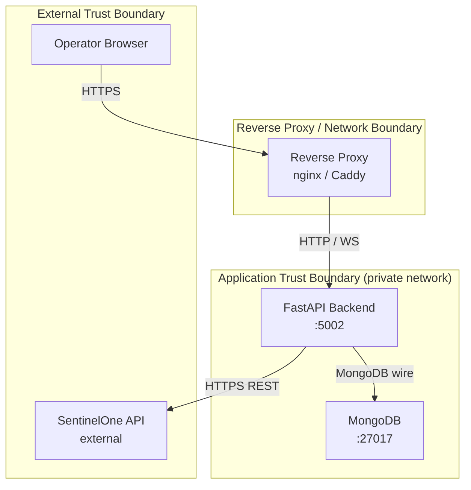

# Threat Model

This document applies the STRIDE framework to Sentora. For each threat category it describes the specific threats in Sentora's context, current mitigations, residual risk, and roadmap items.

---

## Security Assumptions

The following assumptions underpin this threat model. If any assumption is violated, the associated risks change materially.

1. **Deployment mode determines threat surface.** Sentora supports two deployment modes:
   - **On-prem** (`DEPLOYMENT_MODE=onprem`): Single-tenant, deployed on an internal network. Accessed by a trusted team. `admin` is the highest role. No public internet exposure in the default configuration.
   - **SaaS** (`DEPLOYMENT_MODE=saas`): Multi-tenant with database-per-tenant isolation. May be internet-facing. `super_admin` manages the platform; tenant `admin` users manage their own data. Cross-tenant data leakage is a critical concern.
2. **Dual authentication: JWT and API keys.** All API endpoints (except health checks, branding, and deployment info) require either a valid JWT or a valid API key. JWT is used for interactive user sessions; API keys (`sentora_sk_live_...`) are used for external integrations (SIEM, dashboards, automation). Role-based access control enforces least privilege across four roles: `viewer`, `analyst`, `admin`, `super_admin`. API keys use scope-based access control (14 granular scopes). TOTP 2FA is supported. OIDC and SAML SSO are available for enterprise identity providers.
3. **The host operating system and Docker daemon are trusted.** Container-to-host escape is out of scope.
4. **MongoDB is accessible only from the backend container.** The MongoDB port (27017) must not be exposed to external networks. In SaaS mode, tenant databases are isolated by name; network-level MongoDB access control is still required.
5. **TLS is terminated at a reverse proxy.** The backend itself does not terminate TLS; a reverse proxy (nginx, Caddy) handles certificates.

---

## Trust Boundary Diagram

**Trust boundaries:**

| Boundary | Description |
|---|---|
| External | The internet / operator workstation. Untrusted. All traffic must pass through the reverse proxy. |
| Reverse proxy | Terminates TLS, optionally enforces authentication (mTLS, basic auth, OAuth). |
| Application | The internal private network. FastAPI and MongoDB communicate here. MongoDB must not be reachable from outside this boundary. |
| S1 API | External SentinelOne service. Trusted for data authenticity (responses come over HTTPS), but treated as potentially returning unexpected or malformed data. |

---

## STRIDE Analysis

### Spoofing

**Threat:** An attacker pretends to be a legitimate operator and submits API requests (trigger sync, modify fingerprints, acknowledge classifications).

**Current mitigations:**
- JWT-based authentication is required on all API endpoints (except public health/branding/deployment-info routes).
- JWT access tokens include `aud` (audience), `iss` (issuer), `jti` (token ID), and `sid` (session ID) claims for IdP-grade validation (ADR-0021).
- Hierarchical RBAC with four roles (`viewer`, `analyst`, `admin`, `super_admin`) enforces least privilege.
- TOTP two-factor authentication is available (mandatory for admin roles per policy).
- OIDC and SAML SSO integrate with enterprise identity providers.
- Account lockout after 5 failed login attempts (15-minute lockout window) prevents brute-force attacks (ADR-0021).
- Server-side session registry enables immediate session invalidation — revoked sessions are rejected within ~30 seconds via in-memory cache (ADR-0021).
- Password policy engine enforces complexity, history-based reuse prevention, and optional HaveIBeenPwned breach checking (ADR-0021).
- Account lifecycle management (`invited` → `active` → `suspended` → `deactivated` → `deleted`) provides granular access control (ADR-0021).
- New device detection logs audit events when a login originates from an unknown User-Agent (ADR-0021).
- All HTTP responses include an `X-Request-ID` correlation header for audit tracing.
- In SaaS mode, `require_platform_role()` dynamically enforces `super_admin` for platform operations.
- In on-prem mode, the same dependency resolves to `admin`, keeping the experience seamless for single-tenant deployments.

**Residual risk:** Low. Authentication and RBAC are enforced at the middleware level. Server-side sessions provide defense in depth against stolen tokens. Risk increases if JWT_SECRET_KEY is leaked or if the deployment is exposed without TLS.

**SaaS-specific threats:**
- **Tenant impersonation:** An authenticated user in tenant A could attempt to access tenant B's data by manipulating the `X-Tenant-ID` header. Mitigated by `TenantMiddleware` which validates tenant membership.
- **Privilege escalation across tenants:** A tenant `admin` could attempt platform operations. Mitigated by `require_platform_role()` which requires `super_admin` in SaaS mode.

---

### Tampering

**Threat — API request tampering:** An attacker modifies in-flight API requests (e.g. alters a fingerprint definition, changes a classification verdict, or substitutes malicious patterns into taxonomy entries).

**Current mitigations:**
- All data from the frontend is validated by Pydantic models at the API boundary. Unknown fields are rejected (`extra="ignore"` on all DTOs prevents injection of unexpected keys).
- MongoDB write operations use `$set` with field-level updates, not full document replacement, reducing the attack surface for injection.
- The sync pipeline validates S1 API responses against expected shapes before writing to MongoDB. Unexpected fields are ignored.

**Threat — MongoDB tampering:** An attacker with direct MongoDB access alters classification results, fingerprints, or taxonomy entries.

**Current mitigations:**
- MongoDB must only be accessible from the backend container (Docker network isolation). The `docker-compose.yml` does not expose port 27017 to the host by default.
- See production hardening guidance: MongoDB authentication should be enabled in production.

**Residual risk:** Medium. Without MongoDB authentication, any process on the same Docker network can connect directly. Network isolation reduces but does not eliminate this risk.

**Roadmap mitigation:** MongoDB authentication is covered in the deployment hardening guide and will be enforced by default in a future release.

---

### Repudiation

**Threat:** An operator performs a destructive action (deletes a fingerprint, acknowledges a classification result) and later denies doing so. Without an audit trail, the action cannot be attributed.

**Current mitigations:**
- Request logging middleware records every HTTP request with method, path, status code, duration, and a correlation ID. These logs are written to stdout and can be captured by the container runtime.
- Entities with `created_at` / `updated_at` timestamps provide a coarse change history.

**Residual risk:** Low. The audit log records actor identity (username or API key name), action, domain, status, and structured details. Hash-chain integrity (ADR-0021) enables tamper detection. Log tampering is possible only if both the host and the database are compromised.

---

### Information Disclosure

**Threat — S1 API token exposure:** The SentinelOne API token is disclosed in logs, error responses, or API responses.

**Current mitigations:**
- The `S1_API_TOKEN` value is loaded from the environment and held in memory only. It is never written to MongoDB.
- The request logging middleware logs method, path, status code, and duration. It does not log request or response bodies, and does not log the `Authorization` header value.
- The `Settings` model's `s1_api_token` field is annotated to suppress its value in Pydantic's `model_dump()` output, preventing accidental serialization.
- Error handlers in `middleware/error_handler.py` return structured JSON with `error_code` and `message` fields. They do not include stack traces or raw exception messages in production (`APP_ENV != "development"`).

**Threat — MongoDB credential exposure:** `MONGO_URI` containing credentials is logged or returned in responses.

**Current mitigations:**
- `MONGO_URI` is used only to initialize the Motor client. It is never returned in any API response.
- The logging in `database.py` logs the URI at INFO level (connection establishment). In production this log line may contain credentials if they are embedded in the URI. Operators should use a secrets manager to inject `MONGO_URI` rather than embedding credentials in `.env` files committed to version control.

**Threat — Sensitive inventory data exposure:** Agent hostnames, installed application names, and group membership constitute sensitive asset intelligence.

**Current mitigations:**
- All API endpoints require authentication (JWT or API key). Unauthenticated requests receive 401.
- RBAC ensures viewers cannot modify data; analysts cannot manage users.
- API keys are scope-limited — a key with `agents:read` cannot access compliance data.
- HTTPS (via reverse proxy) prevents interception in transit.

**Threat — API key exposure:** A leaked API key provides access to tenant data until revoked.

**Current mitigations:**
- API keys are stored as SHA-256 hashes; the plaintext is shown once at creation and never stored.
- The `sentora_sk_live_` prefix is detectable by GitHub, GitGuardian, and truffleHog secret scanners.
- Immediate revocation — every request validates the key hash against the database.
- Scope-based access control limits the blast radius of a leaked key.
- Per-key rate limiting (configurable per-minute and per-hour) limits abuse velocity.
- API keys cannot manage other API keys (management requires JWT admin auth).
- Key rotation with 5-minute grace period enables zero-downtime credential rotation.

**Residual risk:** Low. Authentication and scope enforcement are active on all endpoints. Risk increases if a key with broad scopes (`write:all`) is leaked and not promptly revoked.

---

### Denial of Service

**Threat — Sync flood:** An attacker repeatedly calls `POST /api/v1/sync/trigger`, overwhelming the S1 API or the backend.

**Current mitigations:**
- `SyncManager` enforces that only one sync runs at a time via an `asyncio.Lock`. A second trigger while a sync is running returns `409 Conflict` immediately.
- `S1_RATE_LIMIT_PER_MINUTE` limits the rate at which the backend calls the S1 API.

**Threat — Large response DOS:** A request for all classification results without pagination parameters could return an arbitrarily large payload.

**Current mitigations:**
- All list endpoints enforce a maximum `limit` parameter (default 100, max 500). Requests beyond the maximum are rejected with a 422 validation error.

**Threat — WebSocket connection exhaustion:** An attacker opens thousands of WebSocket connections to `/api/v1/sync/progress`, exhausting file descriptors.

**Current mitigations:**
- Uvicorn's worker count and connection limits provide some protection. Connections are lightweight since the server only writes to them; reads are minimal.
- A reverse proxy with connection limiting (e.g. `limit_conn` in nginx) should be placed in front of the backend.

**Residual risk:** Low for internal deployments. Medium if exposed to an untrusted network without a rate-limiting reverse proxy.

---

### Elevation of Privilege

**Threat:** An attacker exploits a vulnerability in the FastAPI application to execute arbitrary code on the backend host or container.

**Current mitigations:**
- All input is validated by Pydantic at the API boundary before reaching service or repository code.
- The Docker container runs as a non-root user (Python slim base image default).
- No dynamic code evaluation (`eval`, `exec`) is used anywhere in the application.
- Dependencies are pinned in `pyproject.toml` and audited via `pip-audit` in CI.

**Threat — MongoDB injection:** A malicious input value is injected into a MongoDB query, allowing an attacker to read or modify arbitrary documents.

**Current mitigations:**
- Motor's parameterized query interface is used for all database operations. User-supplied strings are passed as values in query dicts, not interpolated into query strings.
- Glob patterns submitted for taxonomy entries and fingerprint markers are stored as data and matched in Python code (using `fnmatch`), not passed to MongoDB `$where` or `$regex` operators with unescaped user input.

**Residual risk:** Low. The Pydantic validation layer and parameterized MongoDB queries substantially reduce injection risk.

---

## Attack Surface Summary

| Surface | Protocol | Exposure | Notes |
|---|---|---|---|
| Backend REST API | HTTP | Internal network (behind reverse proxy) | All endpoints require JWT or API key auth (except health/branding) |
| Sync progress WebSocket | WS | Internal network | Read-only progress stream; no state mutation |
| MongoDB | TCP (wire protocol) | Internal Docker network only | Must not be exposed externally |
| S1 API (outbound) | HTTPS | Outbound to SentinelOne cloud | Sentora initiates all calls; S1 cannot push data in |
| Container filesystem | — | Docker host | Frontend dist files are read-only mounted volume |

The smallest attack surface is achieved by:
1. Placing the backend behind a TLS-terminating, authenticating reverse proxy.
2. Not exposing MongoDB port 27017 outside the Docker internal network.
3. Running with `APP_ENV=production` (disables Swagger UI).
